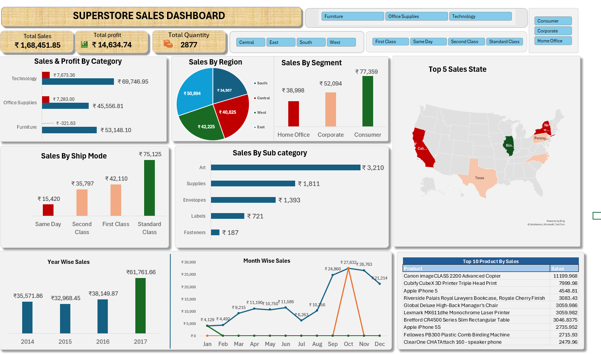

# Sample-Superstore-Sales--Dashboard
Intreractive Excel Sales Dashboard built using the Sample Superstore Dataset.
## 📊 Project Overview

Interactive Excel dashboard created using the Sample Superstore dataset.

## 🛠️ Tools Used

- Microsoft Excel
- Pivot Tables & Charts
- Interactive Slicers
- KPI Cards
- Map Chart
- Data Visualization

## 📈 Analysis

- Sales & Profit by Category
- Sales by Region & Segment
- Sales by Ship Mode
- Monthly & Yearly Sales
- Top 5 States
- Top 10 Products

## 🎯 Objective

To analyze sales performance and present key business insights through an interactive dashboard.
